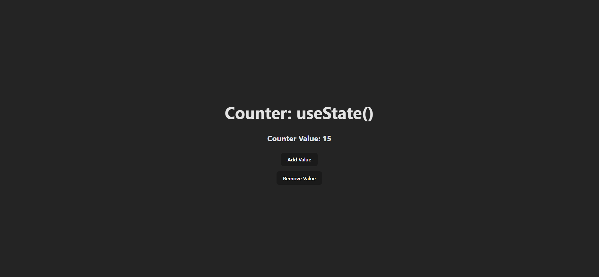

# React Counter App

This is a simple React counter application that demonstrates the usage of the `useState` hook to manage state within a functional component.

## Preview

## Usage

1. Clone this repository to your local machine.
2. Navigate to the project directory.
3. Install dependencies by running `npm install`.
4. Start the development server by running `npm start`.
5. Open your browser and go to `http://localhost:PORT` to view the app.

## Features

- The counter starts with an initial value of 15.
- Users can increment the counter value by clicking the "Add Value" button.
- Users can decrement the counter value by clicking the "Remove Value" button.
- The counter value is displayed on the screen.
- If the counter value reaches zero and the "Remove Value" button is clicked again, it will not decrement further.

## Learnings

- Understanding and implementing the `useState` hook for managing state in a functional component.
- Handling state updates based on user interactions.
- Utilizing conditional logic to prevent the counter from decrementing below zero.

## Technologies Used

- React
- JavaScript (ES6+)

